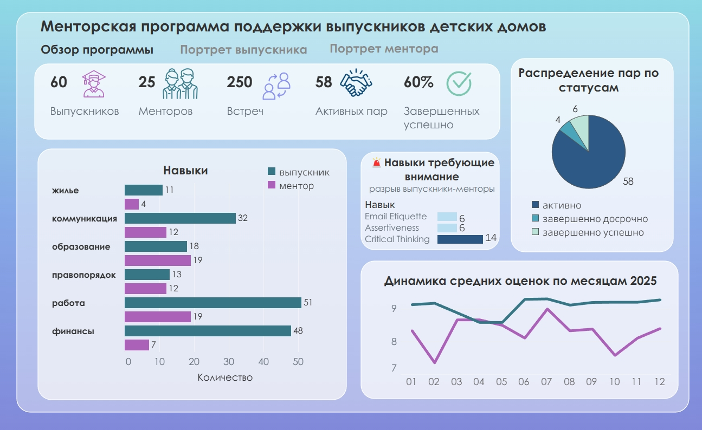

# 📊Портфолио аналитика данных | BI-разработка
**Курылева Ксения, 22** | Санкт-Петербург

## 🎯 О себе
**Образование:** СПбГУ, Прикладная математика и информатика'28, кафедра Математической теории экономических решений

**Инструменты:**  
-Python (Pandas, Matplotlib)  
-PostgreSQL (SQL - DDL, DML, JOIN, Window Functions, Indexes)  
-Power BI (DAX), Tableau  
-C/C++  
-Excel(VBA)

## 🚀 Курсовой проект: Проектирование и реализация базы данных для системы менторской поддержки выпускников детских домов

### Описание

Исходная учебная задача: проектирование базы данных для комплексной автоматизации программы социального наставничества, направленной на поддержку выпускников в процессе их адаптации к самостоятельной жизни, профессиональному становлению и интеграции в общество(выполнено построение БД, к ней приведены запросы, имеющие практическую значимость. 

### Выполнено в рамках базовой задачи

| Элемент | Описание |
|---|---|
| **Схема БД** | 7 таблиц, первичные и внешние ключи, CHECK-ограничения, индексы |
| **SQL-запросы** | 11 запросов с практической значимостью (JOIN, GROUP BY, HAVING, оконные функции) |
| **Тестовые данные**| 18 выпускников, 10 наставников, 42 встречи|

### Добавлено в рамках самостоятельной работы

| Элемент | Что сделано |
|---|---|
| **Python-аналитика** | ETL-процесс с использованием Pandas|
| **Визуализация** | Круговые и столбчатые диаграммы ключевых метрик (Matplotlib) |
| **Дашборд Tableau** | Интерактивная визуализация|

## 📁 Структура репозитория

| Папка/Файл | Описание |
|---|---|
| [`database/`](database) | Схема базы данных (PostgreSQL) |
| [`sql_queries/`](sql_queries) | Аналитические SQL-запросы |
| [`py_analyze/`](py_analyze) | Python-аналитика (Jupyter Notebook, графики) |
| [`dashboard/`](dashboard) | Дашборд в Tableau |

## 📊 Построение дашборда 

**Визуализация:** Tableau Public
**Дизайн элементов:** Figma

## 🔗 Посмотреть дашборд
**[Интерактивный дашборд на Tableau Public](https://public.tableau.com/views/Mentorprogram/sheet0)**

## 📌 KPI-панель

| Метрика | Значение |
|---------|----------|
| Выпускников | 60 |
| Менторов | 25 |
| Встреч проведено | 250 |
| Активных пар | 58 |
| Успешно завершено | 60% |

**Вывод:** Программа охватывает значительное число выпускников при небольшой базе менторов (соотношение 2.5:1). 
Высокий процент успешных завершений (60%) - качественный подбора пар, но возможен **потенциальный дефицит наставников**.

## 📊 График "Навыки"

Сравнение спроса выпускников и предложения менторов по 6 категориям:

| Категория | Выпускники | Менторы | Разрыв |
|-----------|-----------|---------|--------|
| Работа | 51 | 19 | **-32** |
| Финансы | 48 | 7 | **-41** |
| Коммуникация | 32 | 12 | -20 |
| Образование | 18 | 19 | +1 |
| Правопорядок | 13 | 12 | -1 |
| Жильё | 11 | 4 | -7 |

**Вывод:** Наблюдается **системный дефицит наставников** по всем практическим категориям. Критическая ситуация по "Финансам" (-41) и "Работе" (-32) - именно эти навыки наиболее важны для самостоятельной жизни выпускников. Единственная сбалансированная категория - "Образование" (+1).

## 🚨 Блок "Навыки, требующие внимания"

Топ-3 конкретных навыка с наибольшим разрывом:

| Навык | Разрыв |
|-------|--------|
| Critical Thinking | **-14** |
| Email Etiquette | -6 |
| Assertiveness Training | -6 |

**Вывод:** На уровне глубже выявлены **точечные пробелы**. "Critical Thinking" - крайне важная компетенция для самостоятельной жизни. "Email Etiquette" и "Assertiveness" - прикладные soft skills, важны для трудоустройства. Эти навыки не попадают в топ по абсолютным числам, но имеют **наибольшую относительную нехватку** менторов.

## 🥧 Распределение пар по статусам

| Статус | Количество | Доля |
|--------|-----------|------|
| Активно | 58 | 89% |
| Завершено успешно | 6 | 9% |
| Завершено досрочно | 4 | 6% |

**Вывод:** Программа в **активной фазе** - 89% пар ещё в процессе. Низкий процент досрочных завершений (6%) - **положительный сигнал**, указывающий на качественный мэтч в парах. Соотношение успешных к досрочным (1.5:1) говорит о работоспособности программы, есть потенциал для улучшения удержания выпускников.

## 📈 Динамика средних оценок по месяцам 2025

**Наблюдения:**
- **Менторы** ставят стабильно высокие оценки 9.0–9.3
- **Выпускники** стаят оценки нестабильно, диапазон 7.2–8.9
- **Разрыв:** в среднем 0.5–1.0 балла в пользу менторов
- **Провалы:** февраль (7.2) и октябрь (7.5) - месяцы наименьшей удовлетворенности выпускников

**Вывод:**
1. **Систематический разрыв в восприятии:** менторы переоценивают эффективность 
2. **Сезонные провалы:** февраль и октябрь(может быть связаны с адаптационным стрессом)
3. **Восстановление:** после каждого провала оценки растут - положительная долгосрочная динамика

## 🎯 Три приоритетных действия:

1. **Масштабирование** базы менторов по направлениям "Финансы" и "Работа"
2. **Точечное закрытие** дефицита по soft skills (Critical Thinking, Email Etiquette)
3. **Снижение разрыва** в восприятии программы между менторами и выпускниками
 
