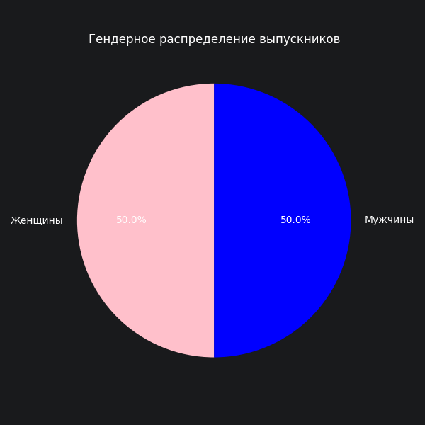
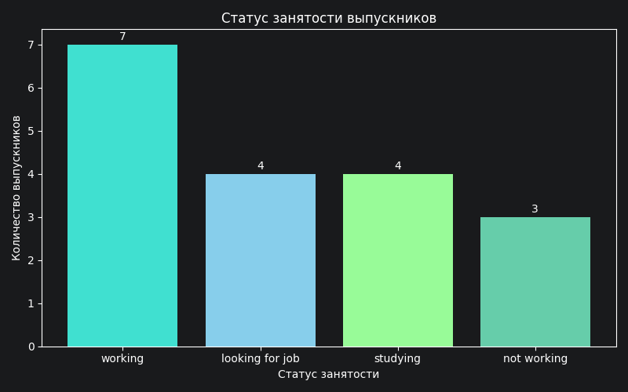
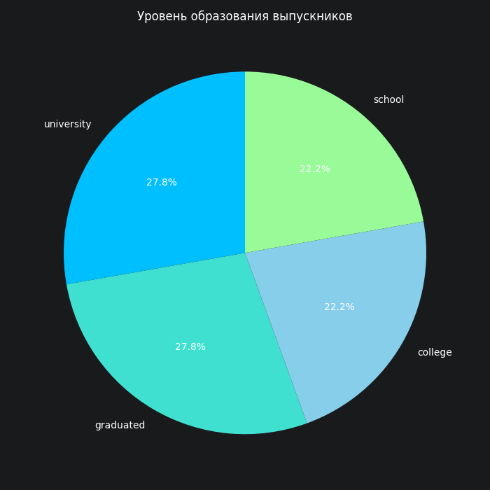

# 📊Портфолио аналитика данных | BI-разработка
**Курылева Ксения, 22** | Санкт-Петербург

## 🎯 О себе
**Образование:** СПбГУ, Прикладная математика и информатика'28, кафедра Математической теории экономических решений

**Инструменты:**  
-Python (Pandas, Matlotlib)  
-PostgreSQL (SQL - DDL, DML, JOIN, Window Functions, Indexes)  
-Power BI (DAX)  
-C/C++  
-Excel(VBA)

## 🚀 Курсовой проект: Проектирование и реализация базы данных для системы менторской поддержки выпускников детских домов

###Описание

Исходная учебная задача: проектирование базы данных для комплексной автоматизации программы социального наставничества, направленной на поддержку выпускников в процессе их адаптации к самостоятельной жизни, профессиональному становлению и интеграции в общество(выполнено построение БД, к ней приведены запросы, имеющие практическую значимость. 

### Выполнено в рамках базовой задачи

| Элемент | Описание |
|---|---|
| **Схема БД** | 7 таблиц, первичные и внешние ключи, CHECK-ограничения, индексы |
| **SQL-запросы** | 11 запросов с практической значимостью (JOIN, GROUP BY, HAVING, оконные функции) |
| **Тестовые данные**| 18 выпускников, 10 наставников, 42 встречи|

### Добавлено в рамках самостоятельной работы

| Элемент | Что сделано |
|---|---|
| **Python-аналитика** | ETL-процесс с использованием Pandas|
| **Визуализация** | Круговые и столбчатые диаграммы ключевых метрик (Matplotlib) |
| **Дашборд Power BI** | Интерактивная визуализация|

## 📁 Структура репозитория

| Папка/Файл | Описание |
|---|---|
| [`database/`](database) | Схема базы данных (PostgreSQL) |
| [`sql_queries/`](sql_queries) | Аналитические SQL-запросы |
| [`py_analyze/`](py_analyze) | Python-аналитика (Jupyter Notebook, графики) |
| [`dashboard/`](dashboard) | Дашборды в Power BI (PDF) |
 
## 📊 Анализ на Python (Pandas) 

Проведен анализ портрета выпускника, сделаны выводы на основе полученных данных

### Статистика

### Гендерное распределение
- **50% женщин, 50% мужчин** — равное участие
  

### Статус занятости

| Статус | Количество | Доля |
|---|---|---|
| looking for job (ищет работу) | 6 | 33.3% |
| working (работает) | 5 | 27.8% |
| studying (учится) | 4 | 22.2% |
| not working (не работает) | 3 | 16.7% |

**Выводы:**
- **33.3%** выпускников находятся в активном поиске работы (ЦА для карьерных встреч)
- **27.8%** уже работают
- **16.7%** временно не работают

**Практическая значение:** Большая доля выпускников трудоустроена - программа выполняет поставленную задачу, усилить карьерные консультации для ищущих работы 

### Уровень образования

| Уровень образования | Количество | Доля |
|---|---|---|
| university (университет) | 5 | 27.8% |
| college (колледж) | 4 | 22.2% |
| school (школа) | 4 | 22.2% |
| graduated (выпускник вуза) | 3 | 16.7% |
| not studying (не учится) | 2 | 11.1% |

**Выводы:**
- **72.2%** выпускников продолжают обучение (школа, колледж, университет)
- **27.8%** имеют высшее образование (university + graduated)
- Лишь **11.1%** не учатся

**Практическое значение:** Так как большая часть выпускников на данный момент продолжают обучение, менторская программа может быть реализована в более гибком формате

  
